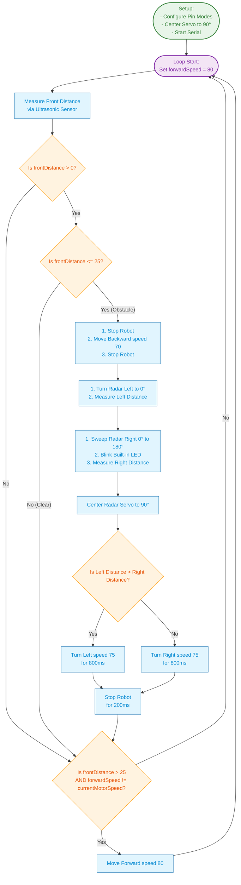
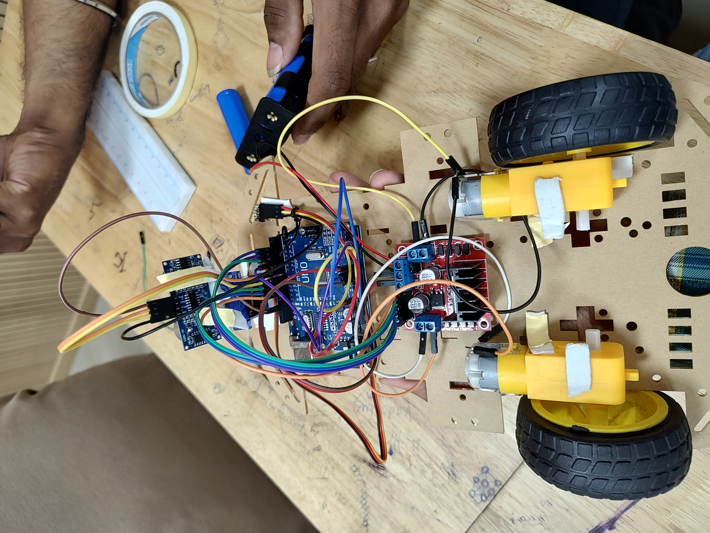
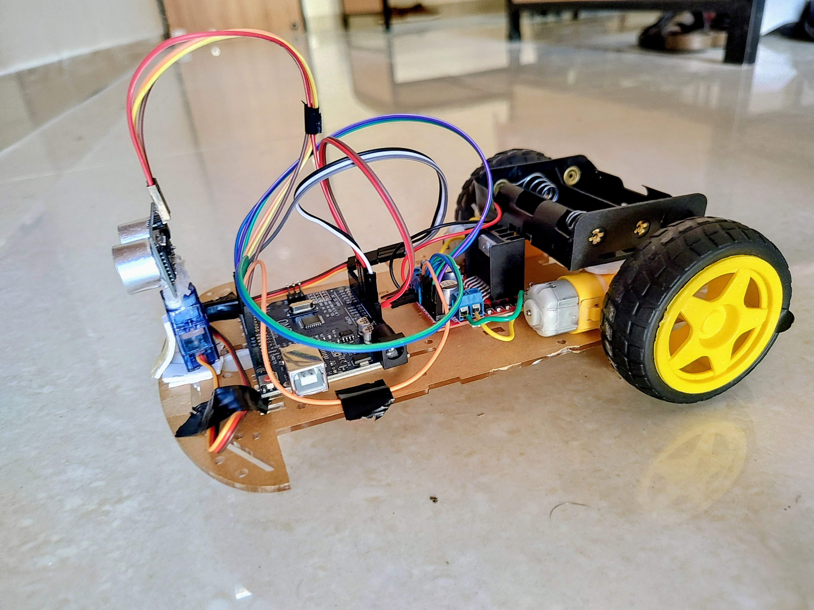

# PRAYAS4 

---
## Lab Group number 37

* Vishalpathania (P426085) 
* Yuga Bharathi K (P426174)
* Rishav ranjan (P426006)
* TA - Mohan Sai Dampa
---
---

## Obstacles Avoiding Robot (From concept to v1.2)
This document details the mathematical framework, calculations, and lookup tables required to make a two-wheel differential drive robot which can execute precise in-place turns, move forward and backwards while avoiding obstacles.


## Simulation
The robot started as simple simulatios on online tool "TinkerCad". A basic version of the robt was made with components available for simulation on TinkerCad. 

### Simulation of the robot
https://www.tinkercad.com/things/lA5BwXk2kSj-diffdrivebotver1/editel?returnTo=https%3A%2F%2Fwww.tinkercad.com%2Fdashboard&sharecode=8Be7qrpKp4Ho1W9cGgfTjN29vAA4K9HrsxYx8px5Kfg

### Simulation Schematics
The schematics for the simulation can be found at [schematicsis](schematics/DiffDriveBot.pdf)

### Robot Schematics
Actual robot is constructed from the same [schematicsis](schematics/DiffDriveBot.pdf) . 

The key difference from schematics is 
* Robot uses LN298 D dual motor power driver.
* 12 V Li Ion Battery pack is used for making the system.

## Robot Construction
The robot consists of following main parts.
* Acrylic Chassis, Track Width ~ 100mm 
* Castor Wheel 
* Yellow Wheel dia 65mm
* Arduino Uno 
* LN298 D dual motor dirver
* Li Ion, battery pack (3 nos, 3.7 V)
* DC motor (max 100 rpm)
* connection wires and jumpers. 

For the prototype, the jumper wires, zip ties are used which do not provide very rigid structure. 
For version 1, these provide a good enough platform for prototyping.

## Software 
The Software is devloped using Arduino IDE and libraries available for Arduino Uno. 
Since this is first prototype and given the processing capabilites of Arduino Uno, a very basic loop for obstacle avoidance is implemented.

## Basic Flow
The simple flow of sense, calcuate and act paradigm of this robot is depicted in following form. 


Download link [Flow Chart](diagram/flowChart.svg)


## Arduino Sketch.
The various versions of [Arduino sketch](Arduino/bot.ino) 
```
#include <Servo.h>

// ---------------- Motor Pins ----------------
const int motorLeftPin1 = 2;
const int motorLeftPin2 = 4;
const int ena = 11;

const int motorRightPin1 = 9;
const int motorRightPin2 = 10;
const int enb = 3;

// ---------------- Ultrasonic Sensor ----------------
const int trigPin = 8;
const int echoPin = 7;

// ---------------- Servo ----------------
const int radarServoPin = 5;
const int vehicleRadarAxisDifferenceAngle = 90; // angle the servo should be in for vehile logtitudnal axis be in line with radar axis.

Servo radar;

// ---------------- Distance Limits ----------------
const float minDistance = 10.0;
const float minSafeDistance = 25.0;
const int sensorDurationMax = 25000;

const int traceBackSpeed = 70;
const int botTurningSpeed = 75;
const int defaultforwardSpeed = 65;
int currentMotorSpeed = 0;

const int maxMotorPWMVal = 80;
const int minMotorPWMVal = 65; // deadband of motor
const float maxMotorPowerDistance = 150;

void setup()
{
  pinMode(motorLeftPin1, OUTPUT);
  pinMode(motorLeftPin2, OUTPUT);
  pinMode(ena, OUTPUT);

  pinMode(motorRightPin1, OUTPUT);
  pinMode(motorRightPin2, OUTPUT);
  pinMode(enb, OUTPUT);

  pinMode(trigPin, OUTPUT);
  pinMode(echoPin, INPUT);

  pinMode(LED_BUILTIN, OUTPUT);

  radar.attach(radarServoPin);
  radar.write(vehicleRadarAxisDifferenceAngle);          // Face forward
  delay(200);
  Serial.begin(9600);
}

void loop()
{
  int forwardSpeed = defaultforwardSpeed; 
  float frontDistance = measureDistance();
  delay(80);

  
  //Serial.println("Front Clearance: " + String(frontDistance));
	if(frontDistance > 0) {
    if(frontDistance <= minSafeDistance){
      stopRobot();
      delay(200);

      backward(traceBackSpeed);
      delay(400);

      stopRobot();
      delay(200);

      // Look Right
      radar.write(vehicleRadarAxisDifferenceAngle-90);
      delay(300);
      float right = measureDistance();
      Serial.println("Rigt Side clearance: " + String(right));
      // Look Left
      for(int i = 0; i<=vehicleRadarAxisDifferenceAngle+90; i=i+30)
      {
        radar.write(i);
        digitalWrite(LED_BUILTIN, HIGH);
        delay(100);
        digitalWrite(LED_BUILTIN, LOW);
        delay(100);
      }
      float left = measureDistance();
      Serial.println("Left Side clearance: " + String(left));

      // Center Servo
      radar.write(vehicleRadarAxisDifferenceAngle);
      delay(300);

      if(left > right) // turn in direction where you have longer visibility
      {
        turnLeft(botTurningSpeed);
        delay(650);
        Serial.println("Turning Left with Speed: " + String(botTurningSpeed));
      }
      else
      {
        turnRight(botTurningSpeed);
        delay(650);
        Serial.println("Turning Right with Speed: " + String(botTurningSpeed));
      }

      stopRobot();
      delay(200);
    }
  } 
  
  if(frontDistance > minSafeDistance){
    //  map distance range 
    int mappedMotorSpeed = map(frontDistance, minSafeDistance,maxMotorPowerDistance, minMotorPWMVal,maxMotorPWMVal);

    if(mappedMotorSpeed != currentMotorSpeed) {
  	  forward(mappedMotorSpeed);
      delay(200);
      //Serial.println("Moving Forward with Speed: " + String(mappedMotorSpeed));
    }
  }  
  
}

// ---------------- Distance Function ----------------

float measureDistance()
{
  digitalWrite(trigPin, LOW);
  delayMicroseconds(2);

  digitalWrite(trigPin, HIGH);
  delayMicroseconds(10);

  digitalWrite(trigPin, LOW);

  long duration = pulseIn(echoPin, HIGH, sensorDurationMax);
  float distance = 0;
  if(duration < sensorDurationMax){
  	//distance = duration / 58.0; //change is to multiplicaiton
    distance = duration * 0.0172; //change is to multiplicaiton
    
  }
  return distance;
}

// ---------------- Robot Movements ----------------

void forward(int speed)
{
  digitalWrite(motorLeftPin1, LOW);
  digitalWrite(motorLeftPin2, HIGH);

  digitalWrite(motorRightPin1, LOW);
  digitalWrite(motorRightPin2, HIGH);

  analogWrite(ena, speed);
  analogWrite(enb, speed);
  currentMotorSpeed = speed;
}

void backward(int speed)
{
  digitalWrite(motorLeftPin1, HIGH);
  digitalWrite(motorLeftPin2, LOW);

  digitalWrite(motorRightPin1, HIGH);
  digitalWrite(motorRightPin2, LOW);

  analogWrite(ena, speed);
  analogWrite(enb, speed);
  currentMotorSpeed = speed;
}

void turnLeft(int speed)
{
  digitalWrite(motorLeftPin1, HIGH);
  digitalWrite(motorLeftPin2, LOW);

  digitalWrite(motorRightPin1, LOW);
  digitalWrite(motorRightPin2, HIGH);

  analogWrite(ena, speed);
  analogWrite(enb, speed);
  currentMotorSpeed = speed;
}

void turnRight(int speed)
{
  digitalWrite(motorLeftPin1, LOW);
  digitalWrite(motorLeftPin2, HIGH);

  digitalWrite(motorRightPin1, HIGH);
  digitalWrite(motorRightPin2, LOW);

  analogWrite(ena, speed);
  analogWrite(enb, speed);
  currentMotorSpeed = speed;
}

void stopRobot()
{
  analogWrite(ena, 0);
  analogWrite(enb, 0);

  digitalWrite(motorLeftPin1, LOW);
  digitalWrite(motorLeftPin2, LOW);

  digitalWrite(motorRightPin1, LOW);
  digitalWrite(motorRightPin2, LOW);
  currentMotorSpeed = 0;
}
		
```


## Learnings

### Mounting various components
* Loose connections
    * Jumper wires are not best options. 
* Flimsy Chassis cuttings, leading to cracking of acrylic. 
* Bobbling of wheels
    * Balancing of wheels is very difficult. 
    * The robo drifts to its side and does not maintain steady path. 
    * Needs constant adjustments, which are not implemented in this version. 
* Mounting of SR04 Ultrasonic sensor of Servo
    * The longitudinal axis of robot and Servo motors zero position does not match all the time. 
    * During gluing of sensor a axis mismatch occurs, which was corrected by adding fixed bias. 
    * This results in some loss of movement at the extreme ends, but is a good compromise.  
* Battery Case mounting
    * Spring loaded battery casing is difficult to handle and causes unexpected shift in variousl components. 
        * used zip-ties but the movement in components (dc motor) still remains. 
        * switch for battery is required, which is not part of this version/kit.
        
### Calibration is necessary, but can not solve for multiple dynamic problems.
* Battery Voltage Changes. 
    Voltage drop causes rpm of motor to change for same PWM command. So the precise contorl becomes difficult.
    * Active feedback is better option for precise control

## Future Enhancements
   * Soldering of components instead of jumper wires.
   * Proper harness and clamps for Motors.
   * Balancing of wheels.
   * Feedback control for motor speed control.
        * encoder based.
   * Add enhanced processing power to implement
        * autonomous navigation algorithms.
        * Localization support.  


## Pictures and Videos


Click below to Watch the video 
[](videos/video1.mp4)

